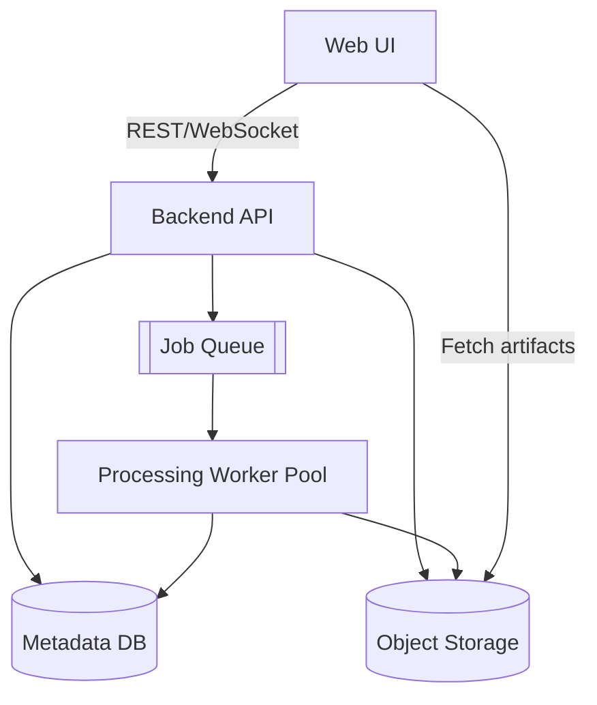
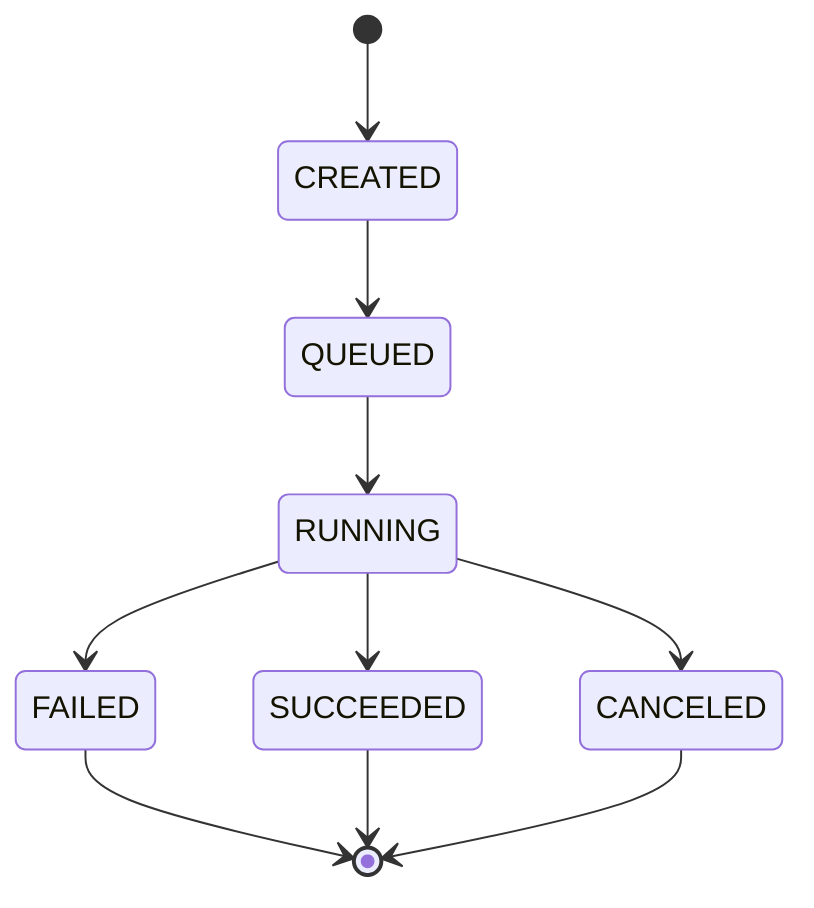
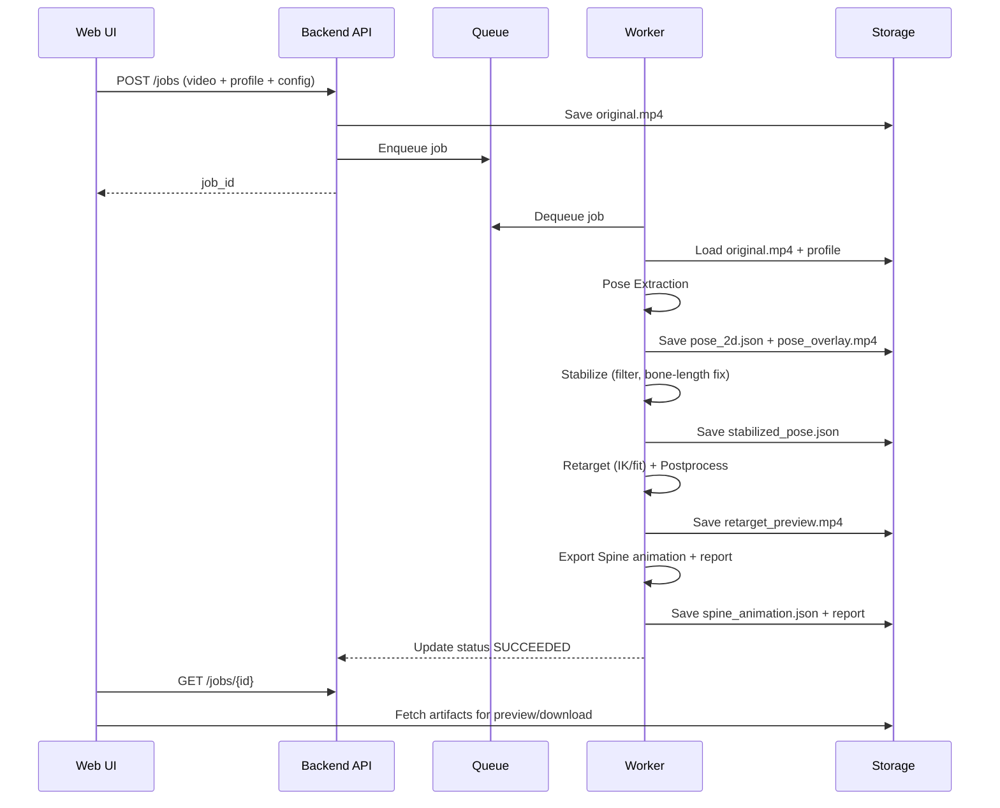

# 视频 → Spine 动画验证器（V2S-Spine）产品开发文档（验证阶段）

> 目的：**验证“从视频自动生成可用的 Spine 动画”这条后半段链路是否可行**，优先关注“效果看起来 OK、可用于游戏运行时播放”，**不以可编辑性为目标**。  
> 形态：Web UI（上传视频 → 处理 → 预览 → 导出 Spine 动画）。  
> 注意：本文档强调产品思路与工程切分，**具体实现细节不写死**（可替换模型/算法/引擎）。

---

## 1. 背景与目标

### 1.1 背景
团队希望探索一种路径：利用 AI/视觉算法从视频中提取角色动作，并将其转换为可在游戏中播放的 **Spine 2D 骨骼动画**。现阶段处于 **想法与方法验证**阶段，先验证后半段链路：

**输入：视频（真人/生成视频） → 输出：Spine 动画（可播放）**

### 1.2 本阶段目标（MVP 验证目标）
- **G1：链路打通**：从一段视频产出一份 Spine 动画数据，能在 Spine Runtime / Spine 编辑器中播放。
- **G2：效果可用**：动作整体连贯、无明显“抖动/跳点/断肢”，满足“看起来 OK”的门槛。
- **G3：展示友好**：Web UI 能展示处理过程与结果（对外演示/内部评审可用），可导出产物与对比图。

### 1.3 非目标（明确不做）
- 不追求生成结果“可编辑/动画师可深度二次加工”。
- 不做“文本 prompt → 生成视频”部分（可用外部工具生成视频作为输入）。
- 不承诺支持所有 Spine rig（先支持 **一套/少数几套**目标骨骼作为验证对象）。

---

## 2. 成功标准与验收口径

### 2.1 “看起来 OK”的验收口径（建议）
> 可按项目经验调整阈值，本阶段重点是建立**可复现的评估流程**。

- **S1：稳定性**：连续播放中，关节角变化无明显抖动（主观观感）。
- **S2：结构合理**：肘/膝不出现频繁反折；手脚不出现明显脱臼或瞬移。
- **S3：接触可信**（若视频包含明显站立/落地）：脚底在接触阶段不出现大范围滑动（允许轻微滑）。
- **S4：可用性**：导出的 Spine 动画能在目标运行时加载、播放、不崩溃。

### 2.2 自动化指标（可选，用于辅助判断）
- **Jitter 指标**：关键点速度的高频分量占比（越低越稳）。
- **骨长漂移**：同一骨段长度的方差（越低越一致）。
- **足部滑移**：接触期足端在地面坐标的漂移距离。
- **丢点率**：姿态估计关键点缺失/置信度过低的帧比例。

---

## 3. 使用者、场景与用户故事

### 3.1 目标用户
- **U1：技术美术/TA**：验证动作能否批量转入游戏；关注效果、速度、兼容性。
- **U2：客户端/引擎开发**：关注导出格式、运行时接入、性能。
- **U3：产品/策划**：关注演示效果、路径可行性、风险与迭代方向。

### 3.2 核心用户故事（MVP）
- **US1**：我上传一段视频，选择目标 Spine 角色（骨骼模板），点击开始处理。
- **US2**：我能看到处理进度与关键中间产物（姿态骨架预览、稳定化结果、重定向结果）。
- **US3**：我能对比“原视频 vs 骨架跟踪 vs Spine 角色播放”的结果（便于展示）。
- **US4**：我能下载导出的 Spine 动画文件（及日志/报告），交给游戏运行时验证。

---

## 4. 产品范围与约束（验证阶段）

### 4.1 输入约束（建议先收敛）
为提升成功率，本阶段建议优先支持以下视频条件：
- 单人、全身较完整可见、遮挡少
- 固定镜头或镜头运动较小
- 分辨率与帧率达到可追踪（例如 720p/1080p，24–60fps）
- 背景相对干净（可选，但有助于稳定）

### 4.2 输出约束
- 输出目标：**某个固定的 Spine skeleton（验证用）**，或少数几个 skeleton profile。
- 动画输出：至少包含骨骼的 rotate/translate（按 rig 需要），可选 IK target / constraint mix / events（验证时可简化）。

---

## 5. 端到端流程（产品视角）

```mermaid
flowchart LR
  A[上传视频] --> B[选择角色/骨骼模板]
  B --> C[选择处理配置\n(模型/滤波/重定向策略)]
  C --> D[提交任务]
  D --> E[处理中\n姿态估计 → 稳定化 → 重定向/拟合 → 导出]
  E --> F[结果预览\n(对比视图)]
  F --> G[下载产物\nSpine动画 + 报告]
```

---

## 6. Web UI 设计（验证版）

### 6.1 信息架构（IA）
- **首页 / Dashboard**
  - 新建任务（Upload）
  - 任务列表（历史记录、状态、下载）
- **任务详情页 / Job Detail**
  - 进度与日志
  - 中间产物预览（Pose、Stabilized Pose、Retargeted）
  - 结果对比播放器（三栏/四栏）
  - 导出下载区（动画文件、报告）

### 6.2 核心页面：任务详情页（线框草图）
> 目的：让观众一眼理解“视频 → 骨架 → 稳定 → 绑到 Spine → 输出”的证据链。

```text
┌────────────────────────── Job: #2026-01-14-001 ──────────────────────────┐
│ Status: RUNNING  |  58%  |  ETA: --  |  Config: Pose=MMPose, Smooth=On  │
├───────────────────────────────────────────────────────────────────────────┤
│ [A] Original Video        [B] Pose Overlay          [C] Retarget Preview   │
│ ┌───────────────┐        ┌───────────────┐        ┌───────────────┐      │
│ │   player       │        │  skeleton     │        │ spine char    │      │
│ │   controls     │        │  overlay      │        │ runtime view  │      │
│ └───────────────┘        └───────────────┘        └───────────────┘      │
│ (可切换: 原视频/骨架/稳定后骨架/最终Spine)                                │
├───────────────────────────────────────────────────────────────────────────┤
│ Timeline:  |----|----|----|----|   Markers: contact/peaks(optional)       │
├───────────────────────────────────────────────────────────────────────────┤
│ Artifacts: pose.json | stabilized.json | mapping.json | spine_anim.json    │
│ Download:  [Spine Anim] [Report] [Debug Bundle]                             │
└───────────────────────────────────────────────────────────────────────────┘
```

### 6.3 对比播放器（展示强需求）
- **三栏模式（推荐）**
  1. 原视频
  2. 姿态骨架覆盖（Pose Overlay）
  3. Spine 角色播放（Retargeted）
- 可选 **四栏模式**：增加“稳定化骨架”一栏，突出抖动被抑制的效果。

### 6.4 可配置项（但不写死实现）
> 验证阶段建议“少而清晰”：对外展示时避免太多参数。

- 姿态模型选择：`{方案A, 方案B, 方案C}`（后端可替换）
- 稳定化：开/关（高级：强度滑杆）
- 重定向策略：`{旋转优先, IK优先, 混合}`
- 坐标系：`{保持画面坐标, 归一化到角色root}`
- 导出：fps、是否压缩关键帧、是否生成事件（可选）

---

## 7. 系统设计（高层，不锁死实现）

### 7.1 模块划分
- **Frontend（Web）**
  - 上传与任务管理
  - 结果预览播放器（视频/骨架/Spine 播放）
  - 下载与分享（生成演示链接）
- **Backend API**
  - Job 创建/查询/状态更新
  - 产物管理（artifact）
  - 配置管理（profiles）
- **Processing Worker（异步任务）**
  - Pose Extractor（视频 → 关键点序列）
  - Stabilizer（去抖/补点/骨长固定）
  - Retarget Solver（关键点 → Spine 控制量）
  - Exporter（写出 Spine 动画文件 + 报告）
- **Storage**
  - 视频原始文件
  - 中间产物（pose、稳定结果、映射、日志）
  - 最终产物（Spine 动画、报告、对比渲染）



### 7.2 任务状态机（建议）


### 7.3 中间产物（Artifacts）建议清单
用于“可视化展示 + Debug”：
- `original.mp4`：输入视频
- `pose_2d.json`：每帧关键点（含置信度）
- `pose_overlay.mp4`：骨架覆盖渲染视频
- `stabilized_pose.json`：稳定化后的关键点
- `retarget_preview.mp4`：Spine 角色播放录屏（或帧序列）
- `spine_animation.json`：导出的 Spine 动画（或二进制）
- `report.md/html`：结果报告（指标 + 截图 + 配置）
- `bundle.zip`：完整调试包

---

## 8. 数据与格式（建议，不写死）

### 8.1 Pose 数据（示例结构）
> 原则：**每帧固定维度、带置信度、可扩展（2D/3D/额外关键点）**

```json
{
  "meta": {
    "fps": 30,
    "frame_count": 300,
    "keypoint_schema": "K=17|33|custom",
    "source_video": "original.mp4"
  },
  "frames": [
    {
      "t": 0.0,
      "joints": [
        {"name": "left_wrist", "x": 123.4, "y": 456.7, "c": 0.91},
        {"name": "right_wrist", "x": 223.4, "y": 466.7, "c": 0.88}
      ]
    }
  ]
}
```

### 8.2 Rig Profile（骨骼映射配置）
> 验证阶段只需支持“固定角色 + 少量配置”，映射可手填或 UI 选择。

```json
{
  "profile_name": "game_char_A",
  "spine_skeleton": "char_A_skeleton.json",
  "mapping": {
    "pelvis": "root/hip",
    "chest": "root/hip/spine/chest",
    "head": "root/hip/spine/chest/neck/head",
    "left_upper_arm": "left_arm_upper",
    "left_lower_arm": "left_arm_lower",
    "left_hand": "left_hand"
  },
  "ik": {
    "left_leg_ik": {"target": "left_foot_target", "bones": ["left_thigh", "left_shin"]},
    "right_leg_ik": {"target": "right_foot_target", "bones": ["right_thigh", "right_shin"]}
  }
}
```

### 8.3 Spine 导出（约定）
- 输出文件结构：`/export/<job_id>/spine_animation.json`（或二进制）
- 动画命名：与 job 名称绑定，避免冲突
- 可选：关键帧压缩（减少体积，提高运行时性能）

---

## 9. 处理流水线（工程视角，保持可替换）

### 9.1 流水线总览


### 9.2 每个阶段的“可视化证据”
- Pose Extraction：输出 overlay 视频（最直观证明“追踪对不对”）
- Stabilize：对比 overlay（抖动减少）
- Retarget：Spine 角色播放对比（最终效果）
- Export：在 runtime/编辑器加载截图（可选）

---

## 10. API 设计（最小集，便于前后端对接）

### 10.1 Job
- `POST /jobs`
  - 入参：视频文件、rig profile、config
  - 出参：`job_id`
- `GET /jobs/{job_id}`
  - 返回：状态、进度、产物列表、可预览 URL
- `GET /jobs`
  - 返回：任务列表（分页）
- `POST /jobs/{job_id}/cancel`（可选）

### 10.2 Artifacts
- `GET /jobs/{job_id}/artifacts`
  - 返回：artifact 元信息（name/type/url/size）
- `GET /profiles`
  - 返回：可选的 rig profiles

> 实现上可用 REST + WebSocket/SSE（实时进度），但不限定。

---

## 11. 演示与报告（给别人看的“展示物”）

### 11.1 自动生成报告（建议输出 Markdown/HTML）
报告内容建议包含：
- 任务信息：输入视频、配置、目标角色
- 三段截图/动图：
  1) 原视频关键帧
  2) Pose overlay 关键帧
  3) Spine 输出关键帧
- 指标概览（可选）
- 风险提示（例如遮挡导致某段失败）

报告模板（示意）：
```markdown
# Job Report: {job_id}

## Input
- video: original.mp4
- profile: game_char_A
- config: Pose=..., Smooth=...

## Visual Comparison
- Original: (thumbnail)
- Pose Overlay: (thumbnail)
- Spine Output: (thumbnail)

## Metrics (optional)
- jitter: ...
- bone length var: ...
- foot slip: ...

## Notes
- segments with occlusion: ...
```

### 11.2 结果展示建议（对外讲述话术）
按顺序讲 4 步：
1. 这是输入视频  
2. 这是我们提取到的骨架（覆盖在视频上）  
3. 这是稳定化后（抖动明显下降）  
4. 这是最终绑定到 Spine 角色后的播放效果（可下载/可运行）

---

## 12. 测试计划（验证阶段）

### 12.1 测试数据集（建议最少 10 条）
- T1：原地走/跑（周期动作）
- T2：跳跃（离地/落地）
- T3：挥手/上身动作（肢体快速）
- T4：转身/侧身（挑战姿态歧义）
- T5：遮挡/复杂背景（失败边界）

### 12.2 评审方式
- 每条视频输出：对比播放器 + 报告
- 三人盲评（TA/开发/产品）给出 1–5 分
- 汇总：成功率、平均分、失败类型分布

### 12.3 失败分类（用于迭代）
- F1：抖动大 / 跳点
- F2：骨骼结构错（左右反、手脚错）
- F3：接触不可信（脚滑、落点漂）
- F4：遮挡导致关键点丢失
- F5：导出/加载失败（格式问题）

---

## 13. 风险与对策（验证阶段重点）

| 风险 | 影响 | 早期对策 |
|---|---|---|
| 文生视频/真人视频抖动、遮挡 | 动作曲线脏、观感差 | 先收敛输入条件 + 稳定化 + 置信度补点 |
| 2D 姿态歧义（前后、转身） | 手脚翻转、跳变 | 强制固定镜头/姿态；必要时引入 3D/时序一致性 |
| Rig 不同导致重定向困难 | 适配成本高 | 验证阶段只支持少数 rig profile |
| 导出 Spine 数据不可用 | 无法进游戏 | 先定义最小可用导出规范 + 自动化加载测试 |
| 结果“可用”标准不一致 | 无法决策 | 明确成功标准 + 固化评审流程/报告 |

---

## 14. 里程碑（以交付物描述，不给时间承诺）

- **M1：链路打通**
  - Web UI 可上传视频 → 生成 pose overlay → 下载产物
- **M2：重定向成功**
  - 产出可播放的 Spine 动画，能在运行时加载播放
- **M3：展示闭环**
  - 任务详情页有三栏对比播放器 + 自动报告 + debug bundle
- **M4：质量初步达标**
  - 10 条测试视频成功率达到预设门槛（可由团队定义）

---

## 15. 附录：术语表
- **Pose / 姿态**：每帧人体关键点或骨架位置序列。
- **Stabilize / 稳定化**：滤波、补点、骨长固定、去抖动等处理。
- **Retarget / 重定向**：将一个骨架/关键点的运动映射到目标角色骨骼上。
- **Spine 动画**：在 Spine 数据结构中定义的骨骼/slot/constraint 的关键帧曲线集合。
- **Artifacts / 产物**：处理过程中生成的可视化文件、数据文件、报告、日志等。

---

## 16. 可选增强（不影响 MVP）
- 批处理（多视频队列）
- 共享链接（只读展示）
- 失败自动诊断（提示遮挡/置信度问题）
- 运行时一键验证（导出后自动在 runtime 渲染一段预览视频）

---

> 文档版本：v0.1（验证阶段）  
> 日期：2026-01-14（Asia/Tokyo）
